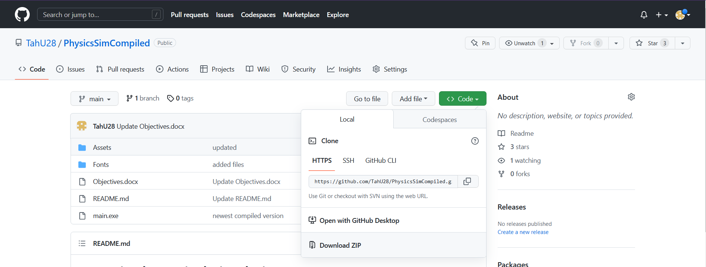

# Required Practical Simulations
### Note: If your anti-virus goes off when downloading it, ignore it and carry on with the download. This isn't due to the contents of the file, but rather the file type being an .exe (executable) file, which anti-malware softwares are by default suspicious of. The alternative to this would be to send the raw source code, but that requires a lot of work on your end to get your device ready to be able to run the code.

In order to download the file, click on the Code button that is in green and click "Download Zip".
Once it has been downloaded, extract the zip file and then open the main.exe file to view the program.
Ensure that the resolution of your computer is at minimum 1920 x 1080, otherwise parts of the program will not be visible.

